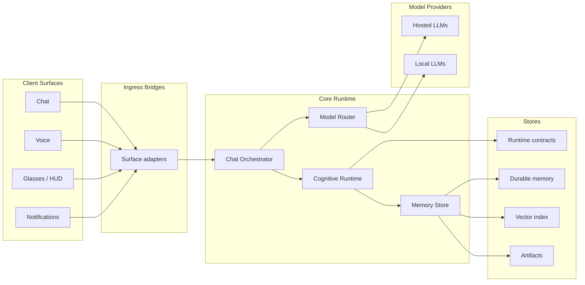

# Architecture Overview

CCP treats the LLM as one important component inside a larger runtime system.

The architecture separates:

- **Client surfaces** — chat, voice, glasses, car, mobile, notifications.
- **Ingress bridges** — adapters that normalize requests and surface metadata.
- **Chat orchestration** — turn assembly, prompt construction, model routing, and response shaping.
- **Cognitive runtime** — runtime state, governance policy, identity scope, world-state projection, and trace summaries.
- **Memory substrate** — durable memory, provenance, retrieval, embeddings, artifacts, and storage.
- **Model providers** — hosted and local LLMs behind replaceable routing.

## High-level service map

## Design principles

### 1. Runtime state is not memory

Conversation state tracks the current interaction: session, turn, continuation, attention, interruption, and active policy. It must not become hidden durable memory.

### 2. World state is not reality

World state is a provisional model of what the runtime currently believes is true. Claims need freshness, provenance, confidence, expiry, and verification policy.

### 3. Memory is not automatically current

Durable memory may be useful later, but old memories can become stale, parked, corrected, or superseded. Retrieval alone is not enough; use policy matters.

### 4. Governance is runtime behavior, not prompt vibes

Privacy, restraint, action authority, intent classification, and answer calibration should be explicit runtime decisions with traceable outputs.

### 5. The model should be replaceable

The surrounding control plane owns state, memory, policy, and traceability. The model contributes reasoning and language generation, but it should not be the only place system behavior lives.
